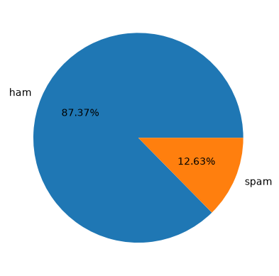
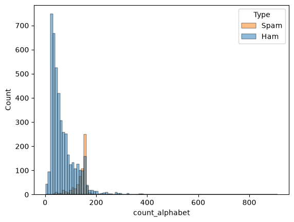
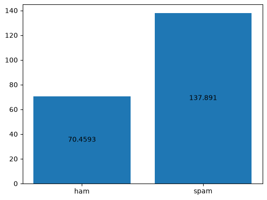
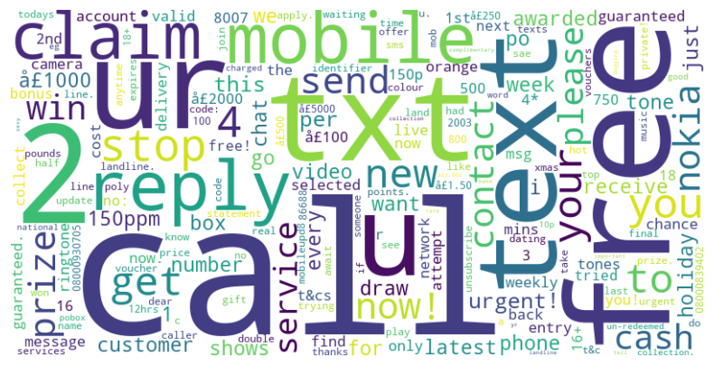
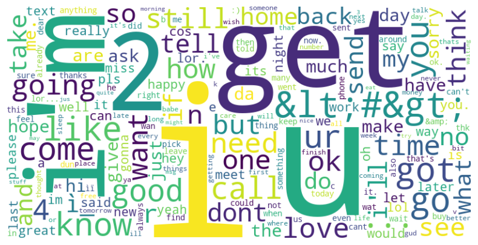
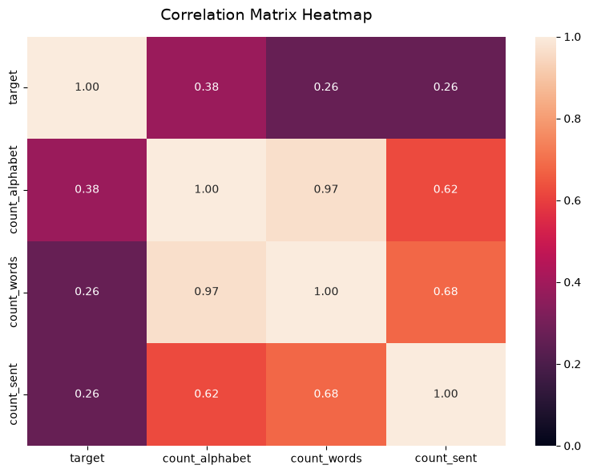
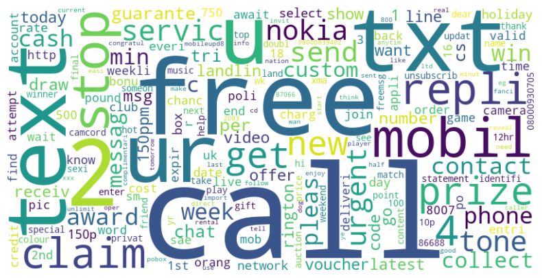

<div align="center">

# 📩 SMS Spam Classifier

[](https://www.python.org/)
[](https://scikit-learn.org/)
[](https://www.nltk.org/)

*An end-to-end Machine Learning solution to detect, filter, and eliminate SMS spam in real-time.*

</div>

---

## 📌 Table of Contents

- [Overview](#-overview)
  - [What is Spam Detection?](#what-is-spam-detection)
  - [Why Do We Need It?](#why-do-we-need-it)
  - [How Machine Learning Solves This](#how-machine-learning-solves-this)
  - [Key Challenges](#key-challenges)
- [Dataset](#-dataset)
- [Data Cleaning](#-data-cleaning)
  - [Inspect Shape & Nulls](#-step-1--inspect-shape--nulls)
  - [Drop Unnecessary Columns](#️-step-2--drop-unnecessary-columns)
  - [Target Encoding](#-step-3--target-encoding)
  - [Handle Missing Values](#-step-4--handle-missing-values)
  - [Remove Duplicates](#-step-5--remove-duplicates)

- [Exploratory Data Analysis (EDA)](#-exploratory-data-analysis-eda)
  - [Class Distribution](#-class-distribution)
  - [Message Length](#️-message-length)
  - [Word Frequency](#-word-frequency)
  - [Character & Punctuation Patterns](#-character--punctuation-patterns)
  - [Correlation with Target](#-correlation-with-target)
  
- [Text Preprocessing](#-text-preprocessing)

- [Model Training & Selection](#-model-training--selection)
  - [Baseline Comparison](#-baseline-comparison-max_features--5000)
  - [Hyperparameter Sweep — Vectorizer `max_features`](#-hyperparameter-sweep--vectorizer-max_features)
  - [Final Model](#-final-model)

---

## 🎯 Overview

> **Goal:** Build an intelligent, high-precision text classification engine that cleanly separates legitimate communication (**Ham**) from malicious or promotional messages (**Spam**).

### What is Spam Detection?
Spam detection is an automated filtering process that categorizes incoming text messages into two primary classes:
* 🟢 **Ham:** Legitimate, safe, and intended communication (e.g., OTPs, personal texts, reminders).
* 🔴 **Spam:** Unsolicited, unwanted, or harmful communication (e.g., promotional blasts, smishing scams).

Using **Natural Language Processing (NLP)** and supervised classification algorithms, this system converts raw text into numerical features to identify suspicious patterns automatically.

---

### Why Do We Need It?

| Dimension | Impact |
| :--- | :--- |
| 🛡️ **Cybersecurity** | Stops **smishing** (SMS phishing) attacks designed to harvest sensitive financial credentials or distribute mobile malware. |
| 💰 **Financial Safety** | Protects users from fraudulent prize claims, fake banking alerts, and imposter scams. |
| 📥 **Inbox Hygiene** | Keeps notifications clean and relevant, ensuring critical alerts aren't lost in promotional noise. |
| ⚡ **Network Optimization** | Reduces unnecessary bandwidth consumption across carrier networks caused by automated spam bots. |

---

### How Machine Learning Solves This

> [!NOTE]
> **Traditional Rule-Based Systems Fail:** Static keyword blacklists (e.g., blocking the word *"FREE"*) are easily bypassed by spammers who alter spelling or formatting.

Machine Learning approach:
1. **Semantic Understanding:** Learns full contextual patterns and word co-occurrences rather than relying on single keywords.
2. **Feature Extraction:** Uses TF-IDF vectorization to assign relative importance weights to words across the corpus.
3. **Dynamic Adaptation:** Generalizes to novel spam variations and evolving text patterns over time.

---

### Key Challenges

* 📐 **Short Text Limit:** SMS messages are capped at 160 characters, resulting in sparse data matrices with limited contextual cues.
* 🔤 **Adversarial Obfuscation:** Spammers deliberately manipulate text using slang, typos, emojis, and spaced lettering (e.g., `F r e e` or `b@nk`).
* ⚠️ **High Cost of False Positives:** Misclassifying a critical message (like a bank OTP or doctor appointment reminder) as spam severely hurts user trust. Precision must be prioritized.

## 📊 Dataset
 
| Detail | Description |
| :--- | :--- |
| **Source** | [UCI SMS Spam Collection](https://www.kaggle.com/datasets/uciml/sms-spam-collection-dataset)|
| **Size** | ~5,574 labeled SMS messages |
| **Classes** | `ham` (≈87%), `spam` (≈13%) — imbalanced |
| **Format** | Tab-separated text file: `label`, `message` |

## 🧹 Data Cleaning

> Raw data was processed through a structured pipeline before any modeling or analysis began.

| Step | Action | Description |
| :---: | :--- | :--- |
| **01** | 🔎 **Inspect Shape & Nulls** | Check dataset size, column data types, and null value counts. |
| **02** | 🗑️ **Drop Unnecessary Columns** | Remove unused metadata columns (`Unnamed: 2/3/4`), each **>99% null**. |
| **03** | 🔢 **Target Encoding** | Convert categorical target classes into numeric format. |
| **04** | 🩹 **Handle Missing Values** | Impute or remove missing values in critical features. |
| **05** | 🧬 **Remove Duplicates** | Eliminate duplicate rows to prevent data leakage in modeling. |

---

### 🔎 Step 1 — Inspect Shape & Nulls

**Shape:** `(5572, 5)`

| # | Column | Non-Null Count | Dtype |
| :---: | :--- | :---: | :---: |
| 0 | `v1` | 5572 non-null | str |
| 1 | `v2` | 5572 non-null | str |
| 2 | `Unnamed: 2` | 50 non-null | str |
| 3 | `Unnamed: 3` | 12 non-null | str |
| 4 | `Unnamed: 4` | 6 non-null | str |

---

### 🗑️ Step 2 — Drop Unnecessary Columns

Three metadata columns carried almost no data and were dropped:

| Column | Missing Value (%) |
| :--- | :---: |
| `Unnamed: 2` | 99.10% |
| `Unnamed: 3` | 99.78% |
| `Unnamed: 4` | 99.89% |

**Column rename for clarity:**

| Original | Renamed To | Role |
| :---: | :---: | :--- |
| `v1` | `target` | Output label |
| `v2` | `text` | Input feature |

---

### 🔢 Step 3 — Target Encoding

> [!TIP]
> **Encoding** converts categorical text into numeric values so ML algorithms can process it.

<table align="center">
<tr>
<th>Technique</th>
<th>How it Works</th>
<th>Best For</th>
</tr>
<tr>
<td><b>One-Hot Encoding</b></td>
<td>Creates a binary column per category</td>
<td>Unordered categories (e.g., colors)</td>
</tr>
<tr>
<td><b>Ordinal Encoding</b></td>
<td>Assigns ranked numeric values</td>
<td>Ordered categories (e.g., low/medium/high)</td>
</tr>
<tr>
<td><b>Label Encoding</b></td>
<td>Assigns a unique integer per category</td>
<td>Target columns in classification</td>
</tr>
</table>

**Strategy used:** Label Encoding on the target column — `ham → 0`, `spam → 1`.

---

### 🩹 Step 4 — Handle Missing Values

| Check | Result |
| :--- | :---: |
| Total missing values | **0** |

---

### 🧬 Step 5 — Remove Duplicates

| Check | Result |
| :--- | :---: |
| Duplicate rows found | **403** |
| Dataset size before | (5572, 2) |
| Dataset size after | **(5169, 2)** |

---

## 🔍 Exploratory Data Analysis (EDA)

> Key insights uncovered before modeling — understanding the data shaped feature engineering and model choice.

---

### 🟢🔴 Class Distribution

The dataset is **imbalanced**, which directly influenced the choice of evaluation metrics (precision/recall over raw accuracy).

| Class | Proportion |
| :--- | :--- |
| 🟢 Ham | ~87% |
| 🔴 Spam | ~13% |

<div align="center">

</div>

---

### ✉️ Message Length

Spam messages tend to run **noticeably longer** than genuine ones — likely due to promotional filler text and links.

| Class | Avg. Length (characters) |
| :--- | :--- |
| 🔴 Spam | ~138 |
| 🟢 Ham | ~70 |

<div align="center">


</div>

---

### 🔤 Word Frequency

> [!TIP]
> Spam vocabulary skews toward urgency and reward-based language, while Ham vocabulary reflects everyday conversation.

<table align="center">
<tr>
<th align="center">🔴 Spam — Common Words</th>
<th align="center">🟢 Ham — Common Words</th>
</tr>
<tr>
<td align="center"><code>free</code>, <code>win</code>, <code>call</code>, <code>claim</code>, <code>urgent</code></td>
<td align="center"><code>ok</code>, <code>home</code>, <code>later</code>, <code>going</code>, <code>love</code></td>
</tr>
<tr>
<td align="center"></td>
<td align="center"></td>
</tr>
</table>

---

### 🔣 Character & Punctuation Patterns

* Spam messages use **more special characters and digits** (e.g., phone numbers, `£`/`$` symbols).
* Excessive **capital letters** and **exclamation marks** appear more frequently in spam.

---

### 📊 Correlation with Target

Message length, digit count, and uppercase word count all show a **positive correlation** with spam likelihood — making them strong candidates as engineered features alongside TF-IDF.

<div align="center">

</div>

---

## 🔤 Text Preprocessing

Before vectorization, each SMS message is processed through the following pipeline:

| Step | Action | Description |
| :---: | :--- | :--- |
| **01** | 🔡 **Lowercasing** | Convert all text to lowercase to ensure uniformity. |
| **02** | ✂️ **Tokenization** | Split text into individual words (tokens). |
| **03** | 🧹 **Remove Special Characters** | Remove special characters like `(`, `)`, `[`, `]`, `+`, `-`, etc. |
| **04** | 🚫 **Remove Stopwords & Punctuation** | Eliminate common words (e.g., *the, is, and*) and punctuation marks that add no predictive value. |
| **05** | 🌱 **Stemming** | Reduce words to their root form (e.g., *"calling" → "call"*). |

---

### ⚙️ Preprocessing Function

```python
import string
import pandas as pd
from nltk.corpus import stopwords
from nltk.tokenize import word_tokenize
from nltk.stem.porter import PorterStemmer

ps = PorterStemmer()

def preprocessing(text: str):
  # converting text into lower case
  text = text.lower()

  # breaking text into tokens
  text = word_tokenize(text)

  # removing special character's
  ans = [word for word in text if word.isalnum()]

  # removing stopwords and punchation's from the text
  text = ans[:]
  ans.clear()

  ans = []
  for word in text:
    if word not in stopwords.words("english") and word not in string.punctuation:
      ans.append(word)

  # apply steaming on the text
  text = ans[:]
  ans.clear()

  ans = [ps.stem(word) for word in text]
  
  return " ".join(ans)
```

```python
df["preprocessed_text"] = df["text"].apply(preprocessing)
```

---

### ☁️ Most Frequent Words After Preprocessing

Word clouds were generated separately for each class to visualize dominant vocabulary post-cleaning.

<table align="center">
<tr>
<th align="center">🟢 Ham — Word Cloud</th>
<th align="center">🔴 Spam — Word Cloud</th>
</tr>
<tr>
<td align="center"></td>
<td align="center"></td>
</tr>
</table>

---

---

## 🧪 Model Training & Selection

> Multiple classifiers were benchmarked across two vectorization strategies (**Count Vectorizer** and **TF-IDF**) to identify the best-performing model before any hyperparameter tuning.

---

### 📊 Baseline Comparison (max_features = 5000)

All models were evaluated with `max_features=5000` on both vectorizers, without hyperparameter tuning.

| Model | Accuracy (Count) | Precision (Count) | Accuracy (TF-IDF) | Precision (TF-IDF) |
| :--- | :---: | :---: | :---: | :---: |
| K Neighbors Classifier | 0.9264 | 1.0000 | 0.9186 | 1.0000 |
| Random Forest Classifier | 0.9748 | 1.0000 | 0.9738 | 0.9800 |
| Logistic Regression | 0.9738 | 0.9800 | 0.9516 | 0.9620 |
| Support Vector Classifier | 0.9729 | 0.9798 | 0.9719 | 0.9896 |
| Extra Trees Classifier | 0.9709 | 0.9794 | 0.9700 | 0.9792 |
| Bernoulli Naive Bayes | 0.9651 | 0.9579 | 0.9641 | 0.9574 |
| Gradient Boosting Classifier | 0.9545 | 0.9419 | 0.9506 | 0.9500 |
| Bagging Classifier | 0.9680 | 0.9167 | 0.9632 | 0.8696 |
| **Multinomial Naive Bayes** | 0.9709 | 0.8661 | 0.9651 | **1.0000** |
| Ada Boost Classifier | 0.9225 | 0.8525 | 0.9157 | 0.9286 |
| Decision Tree Classifier | 0.9583 | 0.8509 | 0.9554 | 0.8130 |
| Gaussian Naive Bayes | 0.8624 | 0.4570 | 0.8479 | 0.4254 |


> **Multinomial Naive Bayes** stood out with **perfect precision (1.0000)** on TF-IDF — meaning it produced **zero false positives**, which is the top priority for this problem (see [Key Challenges](#key-challenges)).

---

### 🔧 Hyperparameter Sweep — Vectorizer `max_features`

To find the optimal vocabulary size, each model was re-evaluated across `max_features` values of 2000–6000, for **both** vectorizers.

<details>
<summary><b>📁 Count Vectorizer — Results by max_features</b></summary>

| Model | Acc (2k) | Prec (2k) | Acc (3k) | Prec (3k) | Acc (4k) | Prec (4k) | Acc (5k) | Prec (5k) | Acc (6k) | Prec (6k) |
| :--- | :---: | :---: | :---: | :---: | :---: | :---: | :---: | :---: | :---: | :---: |
| K Neighbors Classifier | 0.9360 | 1.0000 | 0.9322 | 1.0000 | 0.9302 | 1.0000 | 0.9264 | 1.0000 | 0.9234 | 1.0000 |
| Extra Trees Classifier | 0.9738 | 0.9706 | 0.9758 | 0.9804 | 0.9738 | 0.9615 | 0.9709 | 0.9794 | 0.9758 | 0.9804 |
| Support Vector Classifier | 0.9719 | 0.9796 | 0.9719 | 0.9796 | 0.9738 | 0.9800 | 0.9729 | 0.9798 | 0.9729 | 0.9798 |
| Logistic Regression | 0.9729 | 0.9703 | 0.9738 | 0.9706 | 0.9729 | 0.9703 | 0.9738 | 0.9800 | 0.9738 | 0.9800 |
| Random Forest Classifier | 0.9564 | 0.9875 | 0.9564 | 0.9875 | 0.9516 | 0.9740 | 0.9448 | 1.0000 | 0.9457 | 0.9855 |
| Bernoulli Naive Bayes | 0.9738 | 0.9528 | 0.9709 | 0.9697 | 0.9680 | 0.9688 | 0.9651 | 0.9579 | 0.9632 | 0.9474 |
| Gradient Boosting Classifier | 0.9545 | 0.9419 | 0.9545 | 0.9419 | 0.9545 | 0.9419 | 0.9545 | 0.9419 | 0.9545 | 0.9419 |
| Bagging Classifier | 0.9651 | 0.8850 | 0.9651 | 0.8850 | 0.9641 | 0.8839 | 0.9680 | 0.9167 | 0.9680 | 0.9327 |
| Multinomial Naive Bayes | 0.9671 | 0.8504 | 0.9690 | 0.8527 | 0.9709 | 0.8661 | 0.9709 | 0.8661 | 0.9680 | 0.8462 |
| Decision Tree Classifier | 0.9593 | 0.8293 | 0.9612 | 0.8430 | 0.9564 | 0.8250 | 0.9622 | 0.8559 | 0.9632 | 0.8632 |
| Ada Boost Classifier | 0.9225 | 0.8525 | 0.9225 | 0.8525 | 0.9225 | 0.8525 | 0.9225 | 0.8525 | 0.9225 | 0.8525 |
| Gaussian Naive Bayes | 0.8353 | 0.4056 | 0.8624 | 0.4574 | 0.8624 | 0.4570 | 0.8624 | 0.4570 | 0.8624 | 0.4570 |

</details>

<details>
<summary><b>📁 TF-IDF Vectorizer — Results by max_features</b></summary>

| Model | Acc (2k) | Prec (2k) | Acc (3k) | Prec (3k) | Acc (4k) | Prec (4k) | Acc (5k) | Prec (5k) | Acc (6k) | Prec (6k) |
| :--- | :---: | :---: | :---: | :---: | :---: | :---: | :---: | :---: | :---: | :---: |
| K Neighbors Classifier | 0.9360 | 1.0000 | 0.9322 | 1.0000 | 0.9302 | 1.0000 | 0.9264 | 1.0000 | 0.9234 | 1.0000 |
| Extra Trees Classifier | 0.9738 | 0.9706 | 0.9758 | 0.9804 | 0.9738 | 0.9615 | 0.9709 | 0.9794 | 0.9758 | 0.9804 |
| Support Vector Classifier | 0.9719 | 0.9796 | 0.9719 | 0.9796 | 0.9738 | 0.9800 | 0.9729 | 0.9798 | 0.9729 | 0.9798 |
| Logistic Regression | 0.9729 | 0.9703 | 0.9738 | 0.9706 | 0.9729 | 0.9703 | 0.9738 | 0.9800 | 0.9738 | 0.9800 |
| Bernoulli Naive Bayes | 0.9738 | 0.9528 | 0.9709 | 0.9697 | 0.9680 | 0.9688 | 0.9651 | 0.9579 | 0.9632 | 0.9474 |
| Random Forest Classifier | 0.9612 | 0.9882 | 0.9516 | 0.9867 | 0.9496 | 1.0000 | 0.9409 | 0.9844 | 0.9486 | 1.0000 |
| Gradient Boosting Classifier | 0.9545 | 0.9419 | 0.9545 | 0.9419 | 0.9545 | 0.9419 | 0.9545 | 0.9419 | 0.9545 | 0.9419 |
| Bagging Classifier | 0.9651 | 0.8850 | 0.9651 | 0.8850 | 0.9641 | 0.8839 | 0.9680 | 0.9167 | 0.9680 | 0.9327 |
| **Multinomial Naive Bayes** | 0.9671 | 0.8504 | **0.9690** | **0.8527** | 0.9709 | 0.8661 | 0.9709 | 0.8661 | 0.9680 | 0.8462 |
| Ada Boost Classifier | 0.9225 | 0.8525 | 0.9225 | 0.8525 | 0.9225 | 0.8525 | 0.9225 | 0.8525 | 0.9225 | 0.8525 |
| Decision Tree Classifier | 0.9564 | 0.8145 | 0.9593 | 0.8462 | 0.9574 | 0.8319 | 0.9622 | 0.8500 | 0.9632 | 0.8632 |
| Gaussian Naive Bayes | 0.8353 | 0.4056 | 0.8624 | 0.4574 | 0.8624 | 0.4570 | 0.8624 | 0.4570 | 0.8624 | 0.4570 |

</details>

---

### 🏆 Final Model

<div align="center">

| Parameter | Value |
| :--- | :---: |
| **Algorithm** | `MultinomialNB()` |
| **Vectorizer** | TF-IDF |
| **max_features** | **3500** |
| **Accuracy** | **97.19%** |
| **Precision** | **100%** |

</div>


> **Multinomial Naive Bayes** was selected as the final model — it achieved **perfect precision (1.0)**, meaning **not a single legitimate (Ham) message was misclassified as Spam** in testing. Given that false positives are the costliest error type for this use case, this made it the clear choice over models with marginally higher raw accuracy but lower precision.

---